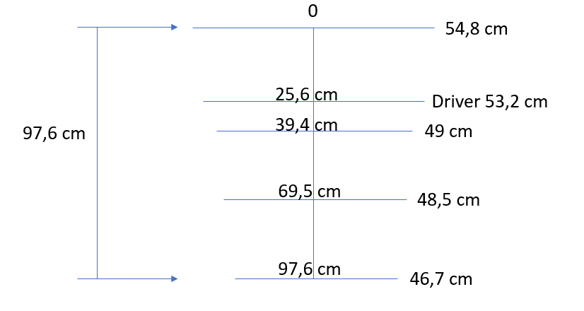
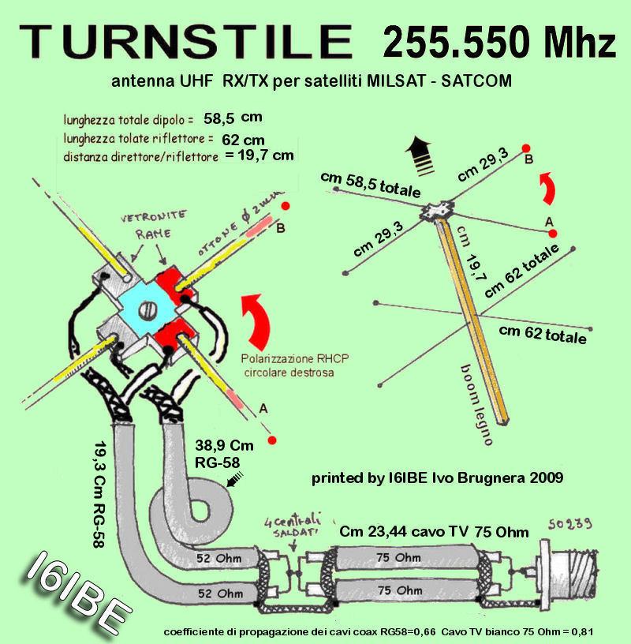
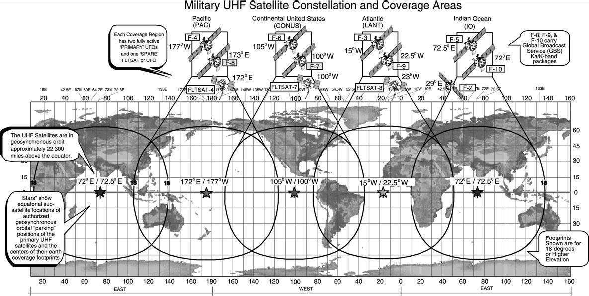
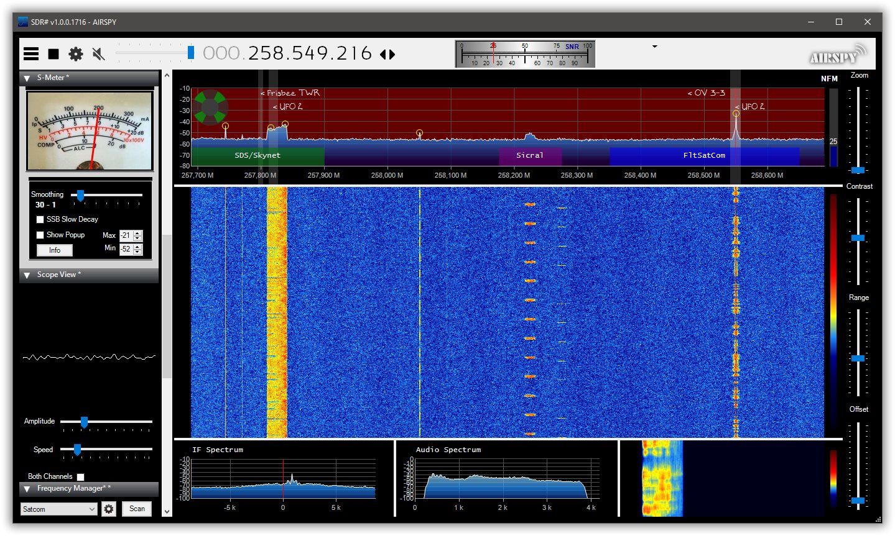
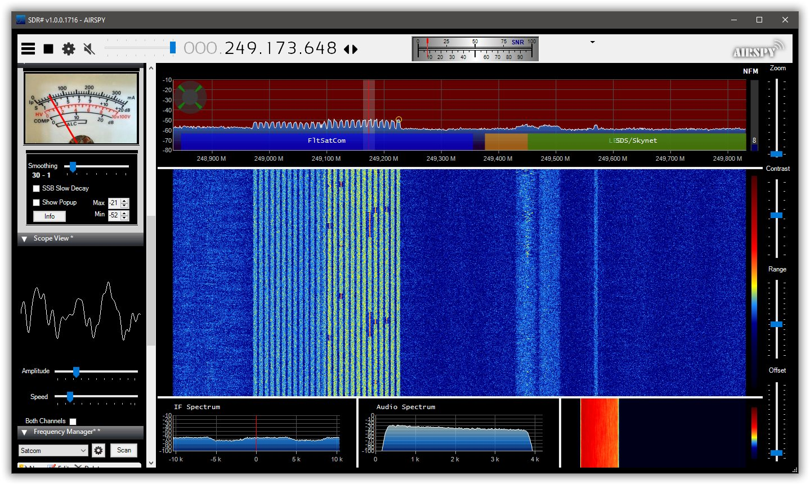
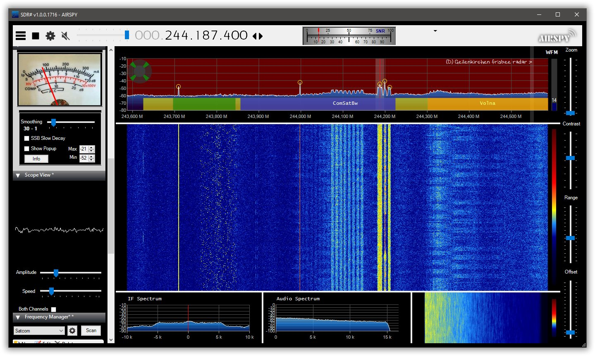
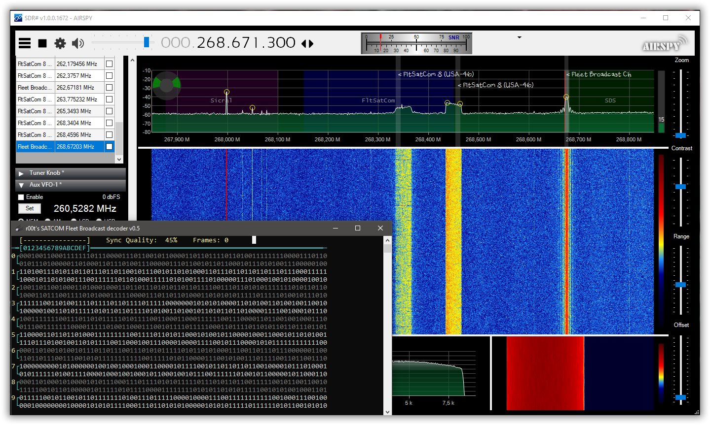

<!DOCTYPE html>
<html class="no-js" lang="en">
  <head>
    <meta http-equiv="content-type" content="text/html; charset=UTF-8">
    <meta charset="utf-8">
    <meta http-equiv="x-ua-compatible" content="ie=edge">
    <meta name="description" content="">
    <meta name="viewport" content="width=device-width, initial-scale=1">
  </head>
  <body>
    

      
 
        

          <h1> UHF SatCom Reception
            &nbsp;&nbsp;&nbsp;&nbsp;&nbsp;&nbsp;&nbsp;&nbsp;&nbsp;&nbsp;&nbsp;&nbsp;&nbsp;&nbsp;&nbsp;&nbsp;&nbsp;&nbsp;&nbsp;&nbsp;&nbsp;&nbsp;&nbsp;&nbsp;&nbsp;&nbsp;&nbsp;&nbsp;&nbsp;&nbsp;&nbsp;&nbsp;&nbsp;&nbsp;&nbsp;&nbsp;&nbsp;&nbsp;&nbsp;&nbsp;&nbsp;&nbsp;&nbsp;&nbsp;&nbsp;&nbsp;&nbsp;&nbsp;&nbsp;&nbsp;&nbsp;&nbsp;&nbsp;&nbsp;&nbsp;&nbsp;&nbsp;&nbsp;&nbsp;
          </h1>
           
          

            
  

          

           
          FLTSATCOM was a satellite communication system of the U.S.
          Navy. 
          Which was used for UHF radio communications between ships,
          submarines, airplanes and ground stations of the Navy. 
          In the late 1990s, FLTSATCOM satellites were gradually
          replaced by the UFO satellites.  
           
          Most of the 12 transponders that operate in the UHF range
          between 240 MHz and 270 MHz on these satellites are simple
          repeaters, 
          with no authentication or control over what they
          re-transmitted and continue to provide UHF communications. 
           
          Because FLTSATCOM 7 and FLTSATCOM 8 Transponders are open (no
          access control) they are often used by unauthorized radio
          users,  
          most often by people in Brazil, Spain and Russia located in
          remote areas.  
          It is very common to hear Spanish,Portuguese and Russian
          transmissions.  
           
          <a href="https://www.wired.com/2009/04/fleetcom/"
            target="_blank">Back in 2009, 39 Brazilian pirates were
            busted, but the activity continues.</a> 
           
          
 

          

            
Contents: 

            <ul>
              <li>Hardware
                <ul>
                  <li>1.1&nbsp; <a href="#Antenna">Antenna</a> 
                    </li>
                  <li>1.2&nbsp; <a href="#Bandplan_">Bandplan</a> 
                    </li>
                  <li>1.3&nbsp; <a href="#SDR_Radio_">SDR Radio</a> 
                    </li>
                  <li>1.4&nbsp; <a href="#Software_">Software</a></li>
                  <li>1.5&nbsp; <a href="#Usefull_Links_">Usefull Links</a> 
                  </li>
                </ul>
              </li>
            </ul>
          

          <h2>Antenna</h2>
           
          To receive SATCOM, you need a receiver that can tune the
          frequency range between 240 MHz and 270 MHz in narrow FM. 
          A wide range of antenna's can be used most popular are Yagi
          and Turnstile's Antenna's. 
           
           
           
          Yagi Design from <a
            href="https://www.scannerforum.nl/index.php?topic=30089"
            target="_blank">Scannerforum.nl</a> 
           
           
           
           
           
           
          Some Turnstile examples: 
           
          <a
            href="https://ua3reo.ru/antenna-dlya-satcom-iz-podruchnyx-materialov/"
            target="_blank">https://ua3reo.ru/antenna-dlya-satcom-iz-podruchnyx-materialov/</a> 
           
          <a
href="https://diebastelkammer.wordpress.com/2018/09/11/uhf-milsat-satcom-eine-faltbare-turnstile-antenne/"
            target="_blank">https://diebastelkammer.wordpress.com/2018/09/11/uhf-milsat-satcom-eine-faltbare-turnstile-antenne/</a>
          <h2>Bandplan 
          </h2>
           
          FLTSATCOM 8/USA-46 located at 15.5 deg west is using the
          Fleetsat Bravo bandplan. 
           
           
           
          <a
            href="http://www.satellitenwelt.de/uhfmilsat.htm#Positionen"
            target="_blank">http://www.satellitenwelt.de/uhfmilsat.htm#Positionen</a> 
           
          <a href="http://qrg.globaltuners.com/?q=milsat"
            target="_blank">http://qrg.globaltuners.com/?q=milsat</a> 
           
          <a href="https://uhf-satcom.com/satellite-reception/uhf"
            target="_blank">https://uhf-satcom.com/satellite-reception/uhf</a> 
           
          <a href="http://www.satellitenwelt.de/UHF_MilSat.pdf"
            target="_blank">http://www.satellitenwelt.de/UHF_MilSat.pdf</a> 
           
          <h2>SDR Radio 
          </h2>
          
 
          

           
           
          AirSpy R2 SDR Radio should work fine for SatCom reception. 
          <h2>Software 
          </h2>
          <a href="https://airspy.com/download/" target="_blank">SDRSharp</a>
          is by far the best operating SDR software for SatCom Narrow
          Band mode. 
           
           
           
           
           
           
           
          The Milstar satellites transmit a digital mode nicknamed the
          “waterdripper.”  
          Between 243.785 and 243.825 MHz it is visible in the spectrum. 
           
           
           
          Fleet Broadcast is a 16 channel 75Bd multiplex transmitted
          from SATCOM satellites on 250.450/550/650 MHz. Modulation is
          DBPSK 1200Bd. 
           
          <a href="http://www.r00t.cz/SW/FBR" target="_blank">Fleet
            Broadcast Decoder v0.5</a>
          <h2>Usefull Links 
          </h2>
          
 

           
          <a href="http://www.satellitenwelt.de/yagi260mhz.htm"
            target="_blank">http://www.satellitenwelt.de/yagi260mhz.htm</a> 
           
          <a
href="https://www.brianswx.com/index.php/11-other-hobbys/116-250mhz-satcom-7ele-yagi"
            target="_blank">https://www.brianswx.com/index.php/11-other-hobbys/116-250mhz-satcom-7ele-yagi</a> 
           
          <a href="https://www.qsl.net/py4zbz/ec/ec.htm" target="_blank">https://www.qsl.net/py4zbz/ec/ec.htm</a> 
           
          <a
            href="http://www.radioamatoripeligni.it/i6ibe/milsat/milsat.htm"
            target="_blank">http://www.radioamatoripeligni.it/i6ibe/milsat/milsat.htm</a> 
           
          <a
href="https://www.google.nl/url?sa=t&amp;rct=j&amp;q=&amp;esrc=s&amp;source=web&amp;cd=5&amp;cad=rja&amp;uact=8&amp;ved=0CEAQFjAE&amp;url=http%3A%2F%2Fhrvhf.net%2Fforum%2Findex.php%3Faction%3Ddlattach%3Btopic%3D1782.0%3Battach%3D9830&amp;ei=3ILPVOH3MYOUatn2grAP&amp;usg=AFQjCNGP3osNndUJ-By7ZiaSSbOZtKaB2w"
            target="_blank">MonitoringUHFSat</a> 
           
        

  </body>
</html>
